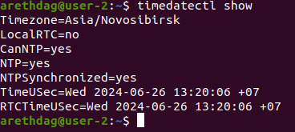
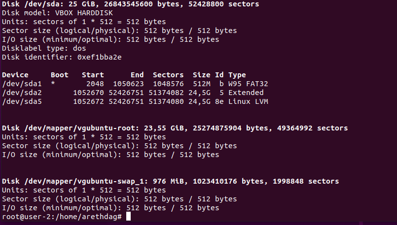
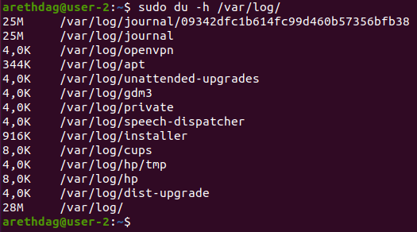

# Операционные системы UNIX/Linux (Базовый).

Установка и обновления системы Linux. Основы администрирования.

## Part 1. Установка ОС

**== Выполнение задания ==**

- Выполнив команду `cat /etc/issue.`, проверим версию установленной Ubuntu. <br>


## Part 2. Создание пользователя

**== Выполнение задания ==**

- Создадим нового пользователя `arethdag` с помощью команды `sudo useradd -G adm -p 1234 -s bin/bash arethdag`<br>
- При выводе команды `cat /etc/passwd` новый пользователь arethdag также отображается. <br>


## Part 3. Настройка сети ОС

**== Выполнение задания ==**

- При вызове `sudo hostname user-1` название машины изменяется на `user-1`.
При вызове `hostnamectl` получаем новое название - `user-1`, что и показано на скриншоте. <br>

---
- Далее, проверим текущюю временную зону. Как можно увидеть, она не соответствует текущему местоположению. <br>

---
- Выведем названия сетевых интерфейсов с помощью консольной команды `ls /sys/class/net`. <br>

> **lo (loopback device)** – виртуальный интерфейс, присутствующий по умолчанию в любом Linux. Он используется для отладки сетевых программ и запуска серверных приложений на локальной машине. С этим интерфейсом всегда связан адрес 127.0.0.1. У него есть dns-имя – localhost. 
---
- Используя консольную команду `curl ipecho.net/plain'`, получим ip адрес устройства, на котором оно работает, от DHCP сервера. <br>
<br>
> **DHCP** – Dynamic Host Configuration Protocol (протокол динамической конфигурации хоста). Это механизм динамической выдачи IP-адресов в сети. IP-адрес (Internet Protocol) - способ адрессации устройств по сети. У каждого устройства свой уникальный ip-адрес. Без DHCP-сервера, администратору пришлось бы вручную настраивать статический IP-адрес каждого устройства, что при большом количестве устройст могло бы привести к ошибке. 

---

- Один из способов узнать внешний ip-адрес устройства - это команда `ip addr`. <br>


== В чем разница между внутренним и внешним ip-адресами шлюза? ==
> Как внешний, так и внутренний ip-адреса предназначены для одной цели, но разница в области видимости. Внешний адрес шлюза используется по всему Интернету, когда внутренний используется только в приватной сети к устройстам, подключенным к ней.

---

- Откроем файл в текстовом редакторе vim с помощью команды `sudo vim /etc/netplan/00-installer-config.yaml`и зададим статичные (заданные вручную, а не полученные от DHCP сервера) настройки ip, gw, dns (использовав публичный DNS серверы, например 1.1.1.1 или 8.8.8.8). 


- Проверяем статические настройки. <br>


----
- Успешно пропинговать удаленные хосты 1.1.1.1 и ya.ru и вставить в отчёт скрин с выводом команды. В выводе команды должна быть фраза "0% packet loss". <br>


> Ping — утилита для проверки целостности и качества соединений в сетях. Утилита отправляет запросы указанному узлу сети и фиксирует поступающие ответы. Время между отправкой запроса и получением ответа позволяет определять двусторонние задержки по маршруту и частоту потери пакетов, то есть косвенно определять загруженность на каналах передачи данных и промежуточных устройствах.

## Part 4. Обновление ОС

**== Выполнение задания ==**
- Выполним `sudo apt update`


- Повторно вызовем команды и получим сообщение об отсутствии новых обновлений. <br>


## Part 5. Использование команды **sudo**

**== Выполнение задания ==**
- Назначение команды sudo
>  Команда sudo - **substitute user and do**, подменить пользователя и выполнить. Главное назначение **sudo** — это выполнить команду от имени другого пользователя, обычно от root. Смысл выполнения команды от root в том, что у него повышенные права доступа и, применяя sudo, обычный пользователь может выполнить те действия, на которые у него недостаточно прав.
---
- Наделим пользователей правами sudo. <br>

- Сменим hostname на user-2. <br>


## Part 6. Установка и настройка службы времени

**== Выполнение задания ==**
- Настройки часового пояса. <br>


## Part 7. Установка и использование текстовых редакторов 

**== Выполнение задания ==**
- Установка текстовых редакторов.<br>
`sudo apt install vim`<br>
`sudo apt install nano`<br>
`sudo apt install mcedit`

### Запись никнейма в файлы и закрытие с сохранением

- **VIM** <br>
 <br>
Для выхода с сохранением нужно нажать Esc, затем написать `:wq`, что означает write and quit.

- **NANO** <br>
 <br>
Для выхода с сохранением нужно выполнить `Ctrl+S` и `Ctrl+X`

- **MCEDIT**<br>
 <br>
Для выхода с сохранением необходимо нажать F10 и выбрать yes. <br>

---

### Запись текста "21 School 21" в файлы и выход без сохранения

- **VIM**<br>
 <br>
Для выхода без сохранения нужно нажать Esc, затем написать `:q!`. Проверим, что изменения не сохранились. <br>
 <br>

- **NANO**<br>
 <br>
Для выхода без сохранения нужно нажать Esc, затем  `Ctrl + X`. Проверим, что изменения не сохранились.<br>
 <br>

- **MCEDIT**<br>
 <br>
Для выхода без сохранения нужно нажать F10, затем выбрать No. <br>

Проверим, что изменения не сохранились. <br>
 <br>

---
### Поиск по слову в файлах
- Внесем те же изменения, что и в прошлом пункте, но сохраним файлы.
- **VIM** <br>
  Поиск: <br>
  Esc + `/<word_to_search>` <br>
   <br>

- **NANO** <br>
  Поиск: <br>
  `Ctrl + W` <br>
  
  
- **MCEDIT**
  Поиск: <br>
  `F7` <br>
  <br>

## Part 8. Установка и базовая настройка сервиса **SSHD**

**== Выполнение задания ==**
- Установим службу SSHd с помощью команды `sudo apt install openssh-server`.<br>
- Автоматически SSHd автостарт службы добавлен при загрузке системы. <br>
 <br>
-Изменить автостарт можно с помощью команд `sudo systemctl disable ssh` или `sudo systemctl enable ssh`. <br>
<br>

-С помощью команды `sudo netstat -tupln | grep ssh` проверяем порт.
<br>

По умолчанию порт задан 22. Изменим на 2022<br>
<br>

- Используя команду ps, покажем наличие процесса sshd.<br>
<br>

> **ax** – будут показаны все процессы подробно. **u** — выводит пользователя и еще доп информацию. **grep sshd** выводит только те строчки, где есть **sshd**

> **netstat -tan** <br>
Команда netstat показывает статистику приема и отправки пакетов, а также информацию об ошибках приема и отправки. <br>
**-a** - Вывод всех активных подключений TCP и прослушиваемых компьютером портов TCP и UDP. <br>
**-n** - Вывод активных подключений TCP с отображением адресов и номеров портов в числовом формате без попыток определения имен.  <br>
Тогда, если **netstat -na** - просмотр всех открытых протоколов, то **netstat -tan** - просмотр всех открытых ТСР-протоколов.

## Part 9. Установка и использование утилит **top**, **htop**

**== Выполнение задания ==**
- Команда top выдает следующий результат: <br>

  - uptime - 3.42 минут
  - количество авторизованных пользователей - 2
  - общую загрузку системы - 0.01
  - общее количество процессов - 212
  - загрузку cpu - 0.00 %
  - загрузку памяти - 893,6 из 5179,6
  - pid процесса занимающего больше всего памяти 1
  - pid процесса, занимающего больше всего процессорного времени - 68686 
  
- htop
  - htop сортируется следующим образом: `htop --sort-key PID` 
  - htop сортируется следующим образом: `htop --sort-key TIME`
  - htop сортируется следующим образом: `htop --sort-key PERSENT_MEM`
  - htop сортируется следующим образом: `htop --sort-key PERSENT_CPU`
  
  
  
    - htop, отсортированный по PID <br>
    
    
    - htop, отсортированный по PERCENT_CPU <br>
    
    
    - htop, отсортированный по PERCENT_MEM<br> 
    
    - htop, отсортированный по TIME<br>
    
    
  - htop, отфильтрованный для процесса sshd<br>
  
  
  - htop с процессом syslog, найденным, используя поиск<br>
  
  
  - htop с добавленным выводом hostname, clock и uptime<br>
  <br>
  
## Part 10. Использование утилиты **fdisk**

**== Выполнение задания ==**
<br>

```
- Название диска: VBOX HARDDISK
- Размер диска: 25 Гигабайт
- Количество секторов: 52428800
- Размер swap: 976 байт
```
## Part 11. Использование утилиты **df** 

**== Выполнение задания ==** 

- df <br>
  
  ```
  для корневого раздела (/):
  - размер раздела - 24118364 Kb
  - размер занятого пространства - 9397052 Kb
  - размер свободного пространства - 13470804 Kb
  - процент использования 42%
  ```
- df -Th <br>
  
  ```
  для корневого раздела (/):
  - размер раздела - 24 Gb
  - размер занятого пространства - 9 Gb
  - размер свободного пространства - 13 Gb
  - процент использования 42%
  ```
## Part 12. Использование утилиты **du**

**== Выполнение задания ==** 
  - du <br>
    
  - размер папок /home в байтах и человекочитаемом виде. <br>
  
  - размер папок /var в байтах и человекочитаемом виде. <br>
  
  - размер папок /var/log в байтах и человекочитаемом виде. <br>
  
  - размер всего содержимого в /var/log. <br>
  
  
## Part 13. Установка и использование утилиты **ncdu**

**== Выполнение задания ==** 
- /home <br>


- /var <br>


- /var/log <br>


## Part 14. Работа с системными журналами

**== Выполнение задания ==** 
- **/var/log/dmesg** <br>
/var/log/dmesg — драйвера устройств. Одноименной командой можно просмотреть вывод содержимого файла. Размер журнала ограничен, когда файл достигнет своего предела, старые сообщения будут перезаписаны более новыми. <br>


- **/var/log/syslog** <br>
/var/log/syslog содержит глобальный системный журнал, в котором пишутся сообщения с момента запуска системы, от ядра Linux, различных служб, обнаруженных устройствах, сетевых интерфейсов и много другого.<br>


- **/var/log/auth.log** <br>
var/log/auth.log — информация об авторизации пользователей, включая удачные и неудачные попытки входа в систему, а также задействованные механизмы аутентификации.<br>

- последня успешная авторизация: Jun 26 11:15:34
- имя пользователя: arethdag
- метод входа в систему: by uid = 0 (User Identifier). Суперпользователь всегда должен иметь UID, равный нулю (0).

- Перезапуск службу SSHd.<br> `systemctl restart ssh`
- скрин с сообщением о рестарте службы: <br>


## Part 15. Использование планировщика заданий **CRON**

**== Выполнение задания ==** 
- **crontab -e** <br>


- **crontab -l** <br>


- **uptime** каждые 2 минуты: <br>


- **crontab -r** <br>

